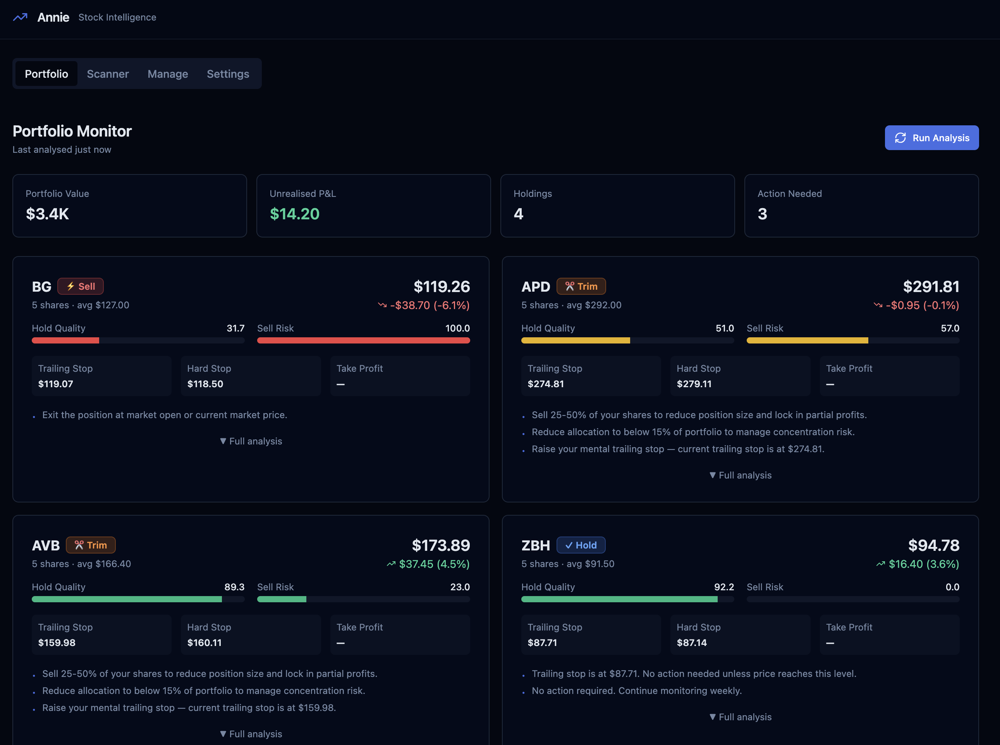

# Annie — Stock Intelligence Engine

A multifactor swing-trade scoring and portfolio monitoring engine. Fetches market data via **Yahoo Finance** (free, no API key), computes technical indicators locally, and produces Buy/Watch/Avoid scores plus portfolio Hold/Trim/Sell recommendations.



## Features

- **Scanner** — Score any US stock 0-100 using 7 weighted technical factors (trend, momentum, volume, entry timing, volatility, multi-timeframe, risk penalty). Outputs Buy / Watch / Avoid with a full trade plan (entry, stop-loss, take-profit, position size).
- **Portfolio Monitor** — Track existing holdings with a Hold Quality Score and Sell Risk Score. Generates Hold / Watch Closely / Trim / Sell / Take Profit recommendations with trailing stop management.
- **React UI** — Single-page app (React + TypeScript + Tailwind) served by a FastAPI backend. Four tabs: Portfolio, Scanner, Manage Holdings, Settings.
- **CLI** — JSON output to stdout; pipe into files or downstream tools.
- **Mock mode** — Five pre-built scenarios (strong buy → auto-avoid) so the full engine works offline without network access.

## Quickstart

```bash
# 1. Install Python dependencies
pip install -r requirements.txt

# 2. Run the scanner in mock mode (no network needed)
python main.py --mock --verbose

# 3. Launch the web UI — production build
cd frontend && npm run build && cd ..
uvicorn api:app --port 8000
# then open http://localhost:8000

# 4. Launch the web UI — development (hot-reload)
uvicorn api:app --reload --port 8000 &
cd frontend && npm run dev
# React on :5173, FastAPI on :8000
```

## Live Data — No API Key Required

Annie uses **Yahoo Finance** (`yfinance`) as its only data source. It's free, requires no account, and works for all US stocks immediately.

```bash
# Live data works out of the box
python main.py --tickers AAPL,MSFT,NVDA
```

## Project Structure

```
annie/
├── config.py             # All weights, thresholds, and settings (single source of truth)
├── market_data.py        # Data fetching: yfinance + local ta indicators → RawIndicatorBundle
├── indicators.py         # Parse RawIndicatorBundle → IndicatorData; normalize each to 0-100
├── scoring.py            # Weighted factor scores → Opportunity Score + recommendation
├── risk.py               # ATR-based stop-loss, take-profit, and position sizing
├── engine.py             # Orchestrate full scanner pipeline; rank and sort results
├── main.py               # CLI entry point (argparse, JSON output)
│
├── portfolio.py          # Holding / Portfolio dataclasses; JSON persistence
├── hold_scoring.py       # Hold Quality Score + Sell Risk Score models
├── portfolio_monitor.py  # Orchestrate portfolio analysis; HoldingReport output
│
├── api.py                # FastAPI backend — all engine capabilities as JSON endpoints
├── universe.py           # S&P 500 + NASDAQ 100 universe; sector/industry metadata
├── scan_worker.py        # Detached subprocess: async scans, writes progress to SQLite
├── db.py                 # SQLite persistence: scan history + live progress tables
│
├── frontend/             # React + TypeScript + Vite + Tailwind UI (built to frontend/dist/)
├── portfolio.json        # Your portfolio (edited via the Manage tab or directly)
├── tickers.json          # Default ticker list for the scanner
│
├── tests/
│   └── test_scoring.py   # 83 unit tests
└── .env.example          # Environment variable template
```

## Scoring Model

### Opportunity Score (Scanner)

| Factor | Weight | Signal Used |
|---|---|---|
| Trend | 25% | Price vs SMA/EMA, ADX strength |
| Momentum | 20% | MACD histogram, RSI (ideal zone: 40-65) |
| Volume | 15% | Volume vs 20-MA ratio (live) or OBV proxy (mock) |
| Entry Timing | 15% | Bollinger Band position, Stochastic %K |
| Volatility | 10% | ATR% inversely scaled (lower = better) |
| Multi-Timeframe | 10% | Daily vs 4h RSI/MACD/MA agreement |
| Risk Penalty | 5% | Overbought, conflicting signals, missing data |

**Recommendation bands:** Buy ≥ 80 · Watch ≥ 60 · Avoid < 60

**Regime adjustment:** Factor weights shift dynamically based on ADX. In a strong trend (ADX ≥ 25) trend weight increases and entry-timing weight decreases. In a ranging market (ADX < 15) entry-timing and momentum weights increase.

**Hard filters (auto-Avoid):** price < $5 · avg volume < 500K · ATR% > 8%

### Hold Quality Score (Portfolio Monitor)

Weighted across trend health, momentum quality, multi-timeframe confirmation, and volatility — tuned to favour continuation over breakout.

### Sell Risk Score (Portfolio Monitor)

Additive penalty model. Key triggers: trailing stop breach, hard stop breach, RSI deterioration, drawdown alarm, concentration risk, MTF divergence, profit target reached.

**Recommendation thresholds:** Sell ≥ 70 · Trim ≥ 50 · Watch Closely ≥ 30 · Hold < 30

## CLI Reference

```bash
# Scan specific tickers
python main.py --mock --tickers AAPL,MSFT,NVDA

# Filter output
python main.py --mock --only-buy --top 5

# Save results
python main.py --mock --output results.json

# All options
python main.py --help
```

## Running Tests

```bash
pytest tests/ -v
pytest tests/ --cov=. --cov-report=term-missing
```

## Configuration

All tunable parameters live in `config.py`:

- Scoring weights and recommendation thresholds
- Risk management defaults (ATR multipliers, position sizing)
- Hard filter thresholds
- Portfolio monitoring thresholds (trailing stop %, drawdown alarms, concentration limit)

Override any value at runtime via environment variables (see `.env.example`).

## Planned Improvements

The following enhancements are designed but not yet implemented:

### Relative Strength (RS) Rating
IBD-style percentile rank of each stock's 12-month price performance vs the full S&P 500 + NASDAQ 100 universe. Stocks in the top 20% (RS ≥ 80) receive a trend/momentum bonus; bottom 20% receive a penalty. Based on Minervini research showing RS leaders outperform during breakouts. Requires maintaining a universe-wide return table (can be computed alongside the sector scanner) and computing live percentile ranks before each scan run.

### Efficiency Ratio (ER)
Perry Kaufman's noise-reduction metric: `ER = |net displacement over N bars| / sum of |daily changes|`. ER near 1.0 means the stock is moving efficiently and directionally (high conviction); ER near 0 means choppy/random movement. Planned use: gate entry-timing scores — only award full entry-timing credit when ER > 0.4. Reduces false positives in ranging/whipsaw markets and rewards clean trending moves.

## Disclaimer

Annie is a personal research and learning tool. Nothing it outputs is financial advice. Always do your own research before making any investment decision.
